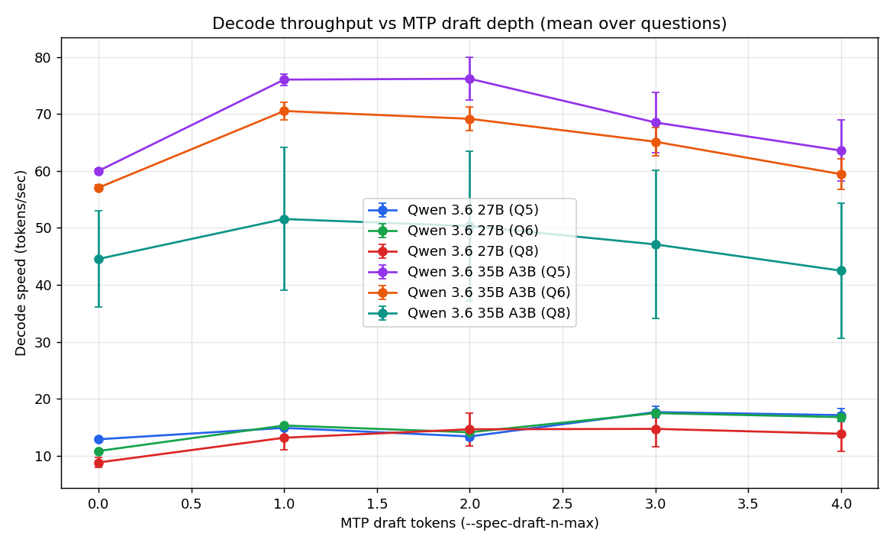
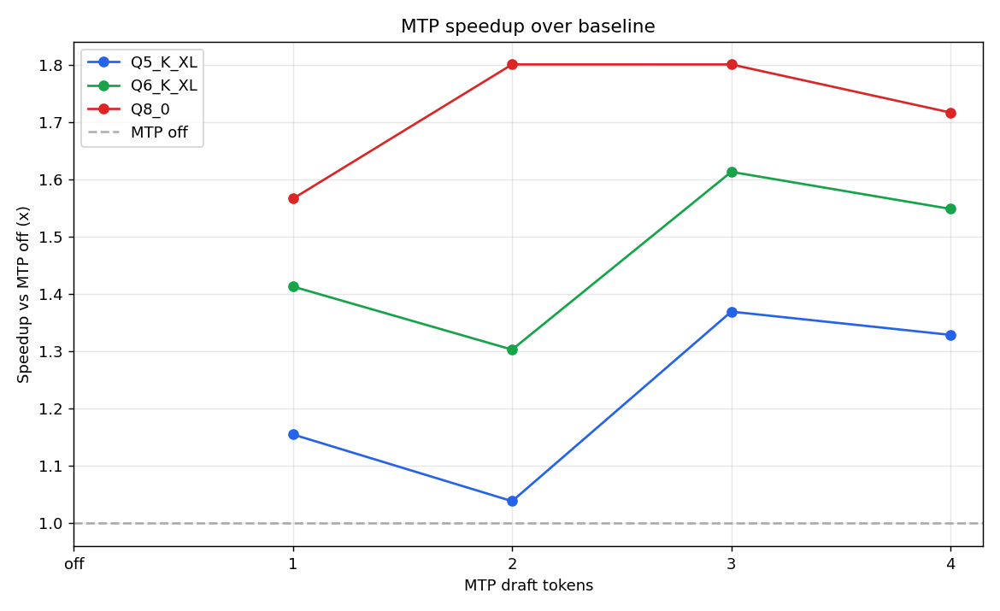
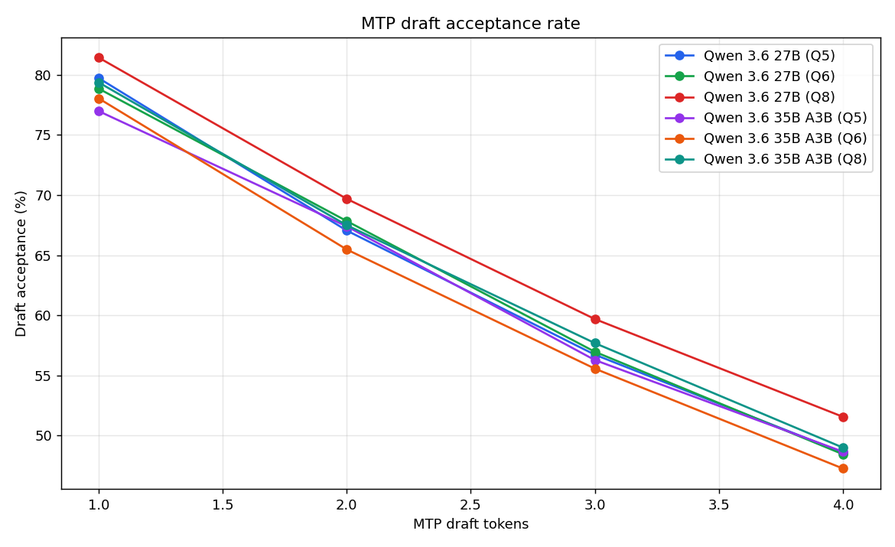
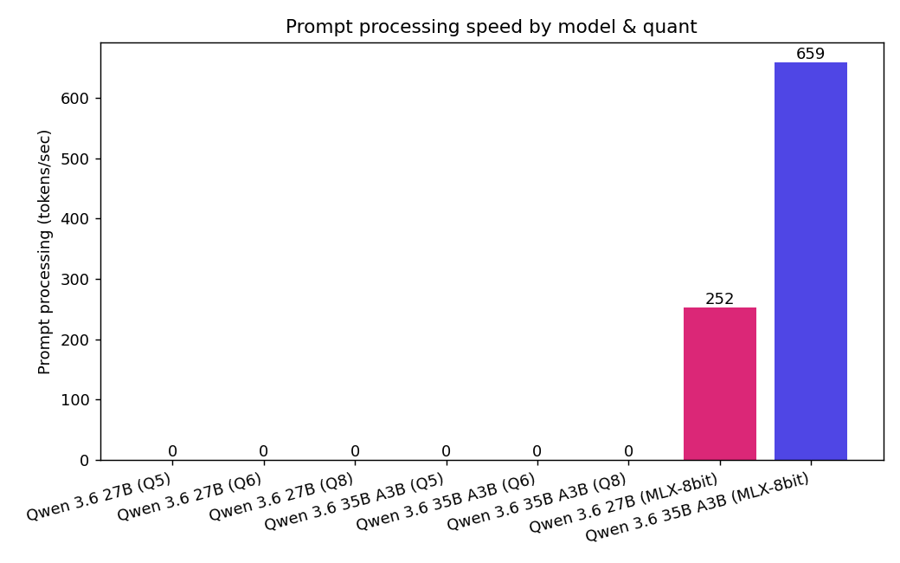
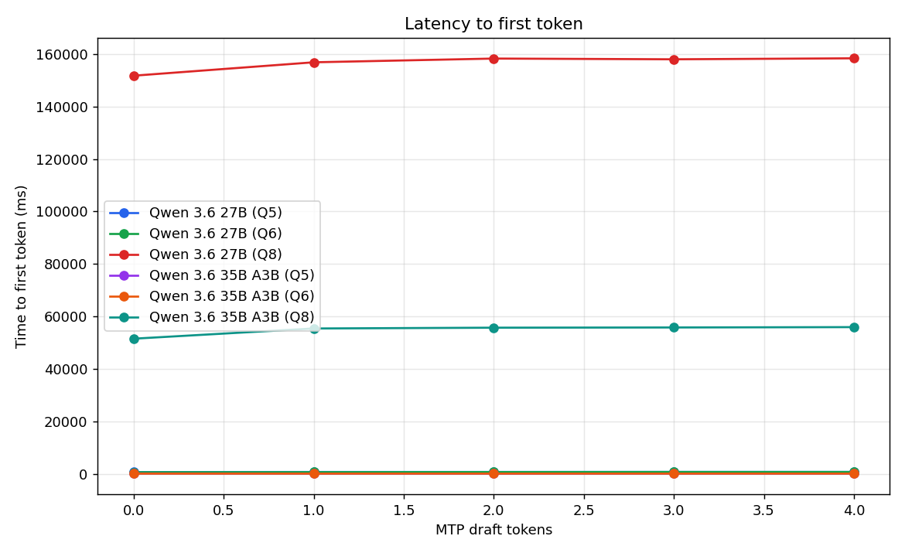
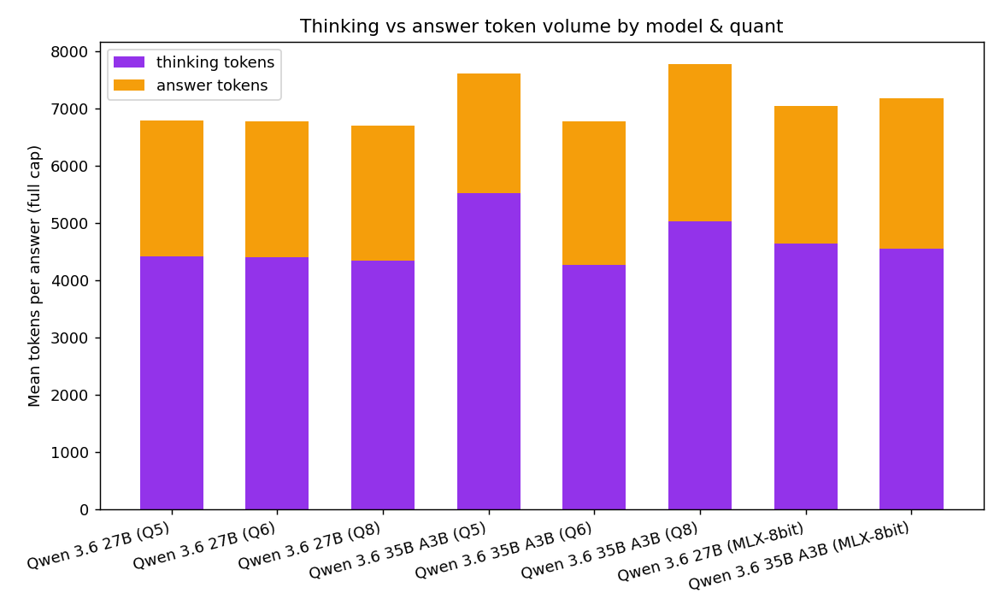
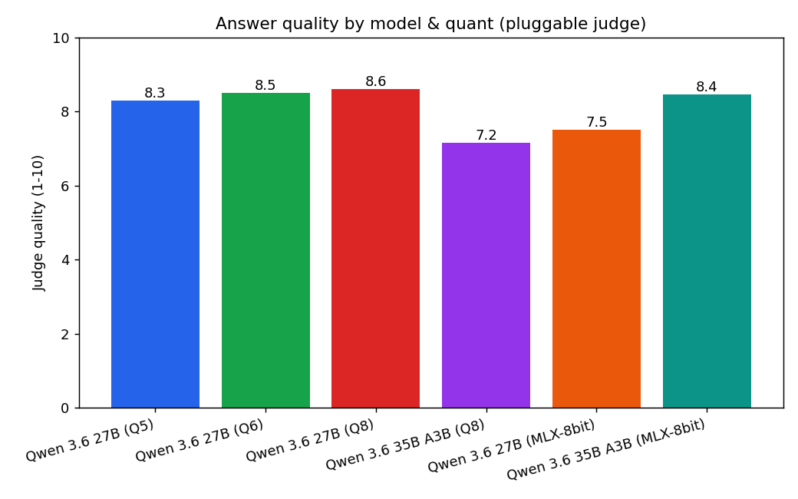
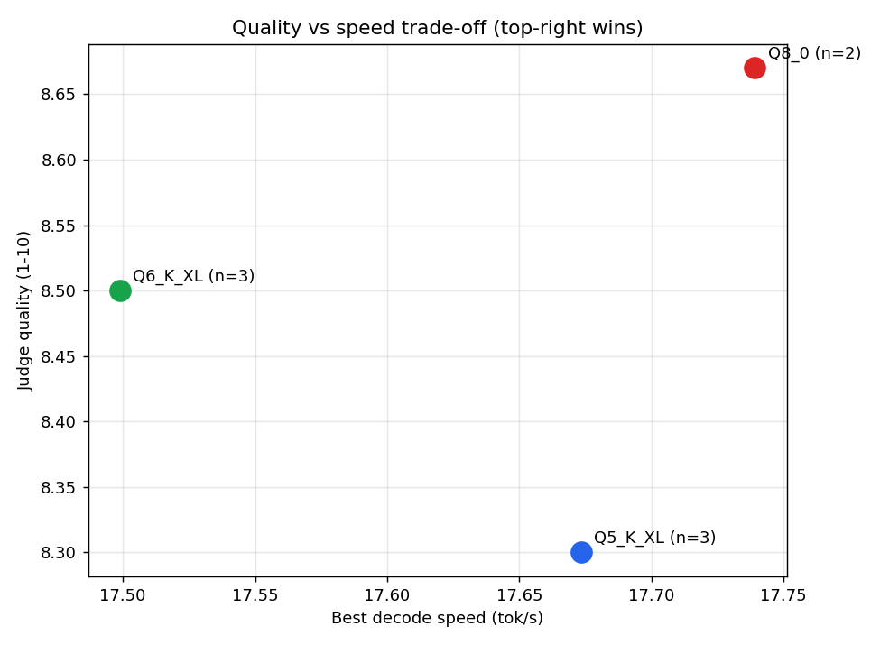
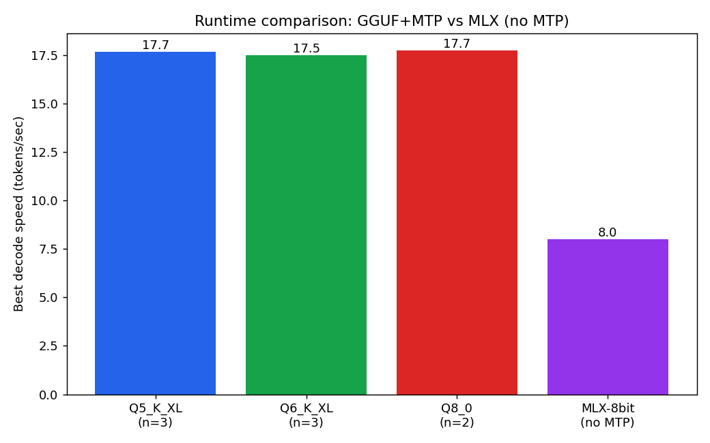

# Qwen3.6-27B MTP benchmark — Q5 / Q6 / Q8 on Apple M5 Pro (64 GB)

_Speed sweep: 75 runs (cap 1024 tok) · full-length: 15 runs (cap 12288 tok) · temp 0.6, seed 42, ctx 16384._

## TL;DR

- **Q5_K_XL** — peak **17.7 tok/s** at draft-n=3 (1.37x vs off, 57% accept); quality 8.3/10; ~6795 tok/answer.
- **Q6_K_XL** — peak **17.5 tok/s** at draft-n=3 (1.61x vs off, 57% accept); quality 8.5/10; ~6781 tok/answer.
- **Q8_0** — peak **17.7 tok/s** at draft-n=2 (1.80x vs off, 68% accept); quality 8.7/10; ~6703 tok/answer.
- **MLX-8bit** (MLX, no MTP) — **8.0 tok/s**, quality ungraded, ~6468 tok/answer.

## Charts



















## Speed sweep (mean over 5 questions)

| quant | draft-n | tok/s | ±sd | accept % | prompt tok/s | TTFT ms |
|---|---|---|---|---|---|---|
| Q5_K_XL | off | 12.9 | 0.2 | - | 257 | 814 |
| Q5_K_XL | mtp1 | 14.9 | 0.3 | 80 | 247 | 849 |
| Q5_K_XL | mtp2 | 13.4 | 0.6 | 67 | 246 | 853 |
| Q5_K_XL | mtp3 | 17.7 | 1.0 | 57 | 242 | 864 |
| Q5_K_XL | mtp4 | 17.2 | 1.2 | 49 | 241 | 868 |
| Q6_K_XL | off | 10.8 | 0.0 | - | 275 | 760 |
| Q6_K_XL | mtp1 | 15.3 | 0.1 | 79 | 266 | 782 |
| Q6_K_XL | mtp2 | 14.1 | 0.2 | 68 | 251 | 829 |
| Q6_K_XL | mtp3 | 17.5 | 0.6 | 57 | 244 | 856 |
| Q6_K_XL | mtp4 | 16.8 | 0.7 | 48 | 246 | 850 |
| Q8_0 | off | 9.9 | 0.0 | - | 282 | 745 |
| Q8_0 | mtp1 | 15.4 | 0.4 | 79 | 277 | 753 |
| Q8_0 | mtp2 | 17.7 | 0.6 | 68 | 275 | 761 |
| Q8_0 | mtp3 | 17.7 | 0.9 | 57 | 257 | 817 |
| Q8_0 | mtp4 | 16.9 | 1.2 | 49 | 253 | 829 |

## Full-length output (8192 cap, off config)

| quant | total tok | thinking tok | answer tok | answers completed |
|---|---|---|---|---|
| Q5_K_XL | 6795 | 4413 | 2378 | 5/5 |
| Q6_K_XL | 6781 | 4397 | 2379 | 5/5 |
| Q8_0 | 6703 | 4349 | 2350 | 5/5 |
| MLX-8bit | 6468 | 4024 | 2443 | 4/4 |

## Output determinism (MTP correctness probe, #23302)

- 6/60 MTP runs produced a different output than their MTP-off baseline (fixed seed). 0 = MTP is output-preserving on this build; >0 flags the known determinism bug.

## Hosting recommendation

On this machine, serve **Q8_0** with `--spec-draft-n-max 2` (~18 tok/s, 8.7/10 quality). Launch line:

```bash
llama-server -m /Users/yash/Models/qwen3.6-27b-mtp-q8/Qwen3.6-27B-Q8_0.gguf \
  --spec-type draft-mtp --spec-draft-n-max 2 \
  -c 16384 -ngl 99 -fa on -np 1 --jinja --reasoning-format deepseek \
  --temp 0.6 --top-p 0.95 --top-k 20 --host 127.0.0.1 --port 8080
```

Wire it into the research engine as an `openai_compat` provider profile (`config/providers.ts`) pointing at `http://127.0.0.1:8080/v1`; the existing `lib/analyst/` adapter then drives it as the brain.
